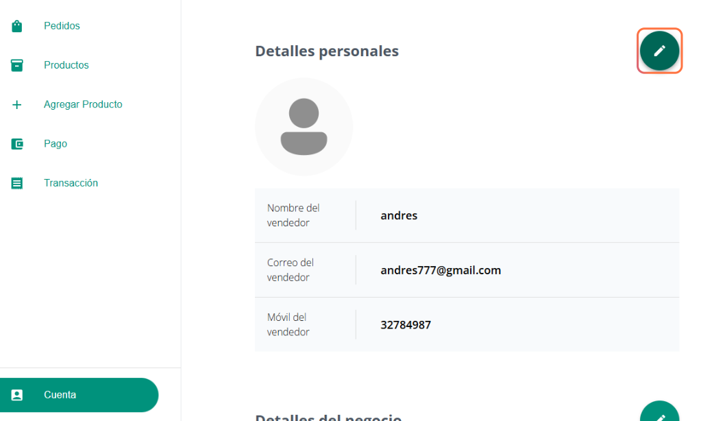

# MANUAL DE USUARIO: Software-S E-commerce

---

## Descripción

Este software de comercio electrónico está diseñado para la venta de **productos tecnológicos** como computadoras, componentes, accesorios y periféricos. Ofrece una experiencia de compra **rápida y segura** para los clientes, mientras que los vendedores pueden gestionar su catálogo de productos, el stock en tiempo real y las órdenes de compra de manera eficiente.

Además, el administrador tiene la capacidad de crear cupones de descuento y gestionar el estado de los vendedores. El sistema integra un **inventario inteligente** que actualiza las existencias automáticamente, genera alertas por bajo stock y permite realizar análisis de ventas para una toma de decisiones más eficiente.

---

## ¿Para quién es este software?

Este software es ideal para:

* **Estudiantes y universitarios:** Que buscan laptops, periféricos y accesorios.
* **Profesionales:** Como diseñadores, desarrolladores, etc., que requieren tecnología específica.
* **Gamers:** Interesados en equipos de alto rendimiento y accesorios especializados.
* **Emprendedores y freelancers:** Que necesitan tecnología para configurar su oficina en casa.
* **Tecnófilos y *early adopters*:** Apasionados por la última innovación tecnológica.

---

## 1. Requisitos del Usuario Final

Para garantizar el correcto funcionamiento del software, asegúrate de cumplir con los siguientes requisitos:

### Navegador Web Compatible

Utiliza una de las siguientes versiones o superiores para una experiencia óptima:

* **Google Chrome:** Versión 100+
* **Mozilla Firefox:** Versión 100+
* **Microsoft Edge:** Versión 100+
* **Safari:** Versión 13+

> **Nota:** El uso de navegadores antiguos podría causar problemas de visualización o funcionalidad.

### Conexión a Internet

* **Velocidad mínima:** 5 Mbps (se recomienda 10 Mbps para una mejor experiencia).
* **Conexión estable:** Evita redes intermitentes para prevenir interrupciones.

### Dispositivo Compatible

* **PC o portátil:** Con Windows 10 o superior, macOS 10.14 o superior, o Linux.
* **Tablet o smartphone:** Con Android 9+ o iOS 13+.
* **Resolución de pantalla mínima:** `1366x768 px`.

### Otros Requisitos

* **Cookies** habilitadas.
* **JavaScript** activado.
* Soporte para **HTML5 y CSS3**.

---

## 2. Acceso y Registro de Cliente

Aquí te explicamos cómo crear una cuenta de cliente y acceder a la plataforma:

### 2.1. Crear una Cuenta de Cliente

1.  En la **página de inicio**, haz clic en **INICIAR SESIÓN**.
    

2.  Serás dirigido a la página de inicio de sesión. Haz clic en **CREAR CUENTA**.
    

3.  En la página de registro, ingresa tu **correo electrónico** y haz clic en **ENVIAR OTP**.
    
    

4.  Recibirás una notificación confirmando que el OTP (One-Time Password) fue enviado. Revisa tu **correo electrónico** para obtener el código.
    
    

5.  Ingresa el **OTP recibido** y tu **nombre** en el formulario. Haz clic en **SIGNUP** para finalizar el registro.
    

6.  Una vez registrado, tu **nombre de usuario** aparecerá en la esquina superior derecha de la pantalla, indicando que has iniciado sesión.
    

---

## 3. Acceso como Vendedor

Sigue estos pasos para iniciar sesión como vendedor:

1.  En la página principal, busca la sección "Vende tus productos en línea" y haz clic en **INICIA COMO VENDEDOR**.
    

2.  Serás dirigido a la página de inicio de sesión para vendedores. Ingresa tu **correo electrónico de vendedor** y haz clic en **ENVIAR OTP**.
    

3.  Recibirás una confirmación del envío del OTP. Revisa tu **correo electrónico** para obtener el código.
    
    

4.  Ingresa el **código OTP** y haz clic en **INICIAR SESIÓN**.
    

5.  Al iniciar sesión, serás redirigido al **panel de control del vendedor**, donde podrás gestionar tus productos y ventas.
    

---

## 4. Funciones de Cliente

Descubre cómo navegar, buscar productos y realizar compras en la plataforma:

### 4.1. Navegación

La **barra superior** de la página contiene un menú desplegable, un buscador, opciones de inicio de sesión, tu lista de deseos y el carrito de compras.

El **menú desplegable** te permite acceder rápidamente a categorías de productos específicas.

### 4.2. Búsqueda de Productos

1.  Haz clic en el **ícono de la lupa** en la barra superior para iniciar una búsqueda.
    
2.  En la nueva pestaña de búsqueda, ingresa el **nombre del producto** que deseas encontrar.
    
3.  Los **resultados de tu búsqueda** aparecerán en pantalla.
    

### 4.3. Lista de Deseos y Carrito de Compras

* **Lista de Deseos:** Haz clic en el **ícono del corazón** para ver los productos que has guardado para más tarde.
    
* **Carrito de Compra:** Haz clic en el **ícono del carrito** para ver los productos que tienes listos para comprar.
    

### 4.4. Proceso de Compra

1.  Haz clic en un producto para ver sus **detalles**, como precio y calificación.
    

2.  Ajusta la **cantidad** y agrega el producto a tu carrito haciendo clic en **ADD TO BAG**, o a tu lista de deseos seleccionando **WHISHLIST**.
    

3.  Así se ve un producto añadido a la **lista de deseos**.
    

4.  En el **carrito de compra**, puedes aplicar cupones de descuento y proceder al pago haciendo clic en **COMPRAR AHORA**.
    

5.  Completa los **datos de pago**. Primero, haz clic en **Iniciar sesión** (si se te solicita) y luego en **Continuar y revisar pedido**.
    
    

6.  Si el pago es exitoso, verás una **confirmación**. Haz clic en **Ver mis pedidos** para revisar los detalles de tu compra.
    
    

---

## 5. Módulo Vendedor

Al acceder al módulo vendedor, se desplegarán varios submódulos en la barra lateral para gestionar tu negocio:

* **Panel de control:** Muestra tus ganancias y ventas totales, entre otras estadísticas importantes.
    
* **Ventas:** Visualiza el historial completo de tus ventas con detalles de cada transacción.
    
* **Productos:** Administra tus productos existentes. Puedes **actualizar el stock con un clic** o **editar la información** de cualquier producto.
    
    
    
    
* **Agregar Producto:** Rellena el formulario con los datos del nuevo producto, sube una imagen y haz clic en "Agregar producto" para guardarlo en tu catálogo.
    
    
    
* **Pago:** Revisa los pagos recibidos por las compras de los clientes. Usa los **botones de paginación** para navegar por los registros de pagos.
    
    
    
    
* **Cuenta y Cerrar Sesión:** En la sección `Cuenta` puedes visualizar y actualizar tus datos personales y de vendedor. El botón `Cerrar sesión` en la misma barra lateral te regresará a la página de inicio de la tienda.
    

---

## 6. Módulo Administrador

El módulo de administrador te permite tener un control total sobre el funcionamiento de la plataforma:

### 6.1. Gestión de Vendedores

En el **Panel de control**, el administrador puede gestionar el estado de las cuentas de los vendedores. Al hacer clic en **CHANGE STATUS**, puedes cambiar el estado de "Pendiente de Verificación" a "Activa", por ejemplo.

### 6.2. Gestión de Cupones

* **Agregar nuevo cupón:** Rellena el formulario con los detalles del cupón y haz clic en **CREAR CUPÓN**.
 
  
 * Una alerta confirmará la creación exitosa.
    
   
* **Cupones:** En esta sección, puedes visualizar todos los cupones existentes, filtrarlos por estado y eliminarlos según sea necesario.
    
    
    
    

### 6.3. Gestión de la Página de Inicio

En la página de inicio, el administrador puede controlar qué imágenes se muestran en la pantalla principal de la tienda.

### 6.4. Actualizar Categoría/Imagen de la Página de Inicio

Para actualizar una imagen de categoría, haz clic en el **ícono de lápiz**. Se desplegará un formulario donde podrás introducir la **URL de la nueva imagen**, y las **tres categorías** asociadas a ella.
